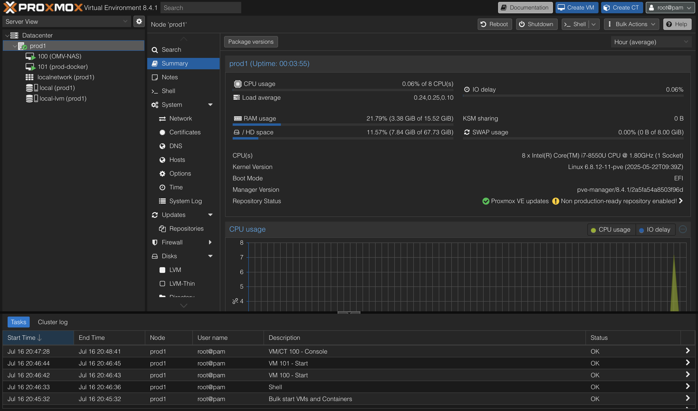

# 🧪 My Homelab Project

Welcome to my homelab project! This project documents my ongoing journey into building and maintaining a functional homelab — experimenting, learning, and improving through hands-on experience. It will evolve over time as I expand the infrastructure, add new services, and dive deeper into more advanced topics.

## Purpose & Goals

- Hands-on learning with real-world tools and systems
- Gain experience in:
  - Troubleshooting
  - Networking (firewalls, routing, VLANs, etc.)
  - Server management (VMs, containers, monitoring)
  - Automation (scripts, infrastructure as code)
  - Security best practices
- Document and track progress over time
- Build a scalable and upgradeable home infrastructure

## Current Hardware Setup

| Component             | Details                          |
|----------------------|----------------------------------|
| **Main Server**       | Lenovo ThinkPad T480 (Proxmox)             |
| **Router and Gateway**            | GL.iNet Flint 2 |

> [!NOTE]
> This setup is just a starting point. The current hardware is far from ideal for a full homelab environment, and I plan to replace or upgrade components as the project evolves.

## Current Setup & Self-Hosted Services

| Name                | Description                                      |
|---------------------|--------------------------------------------------|
| `OMV-NAS`           | NAS solution using **OpenMediaVault**            |
| `prod-docker`       | Container host for self-hosted apps              |
| Nginx Proxy Manager | Reverse proxy with SSL support                   |
| Portainer           | Web UI for managing Docker containers            |
| Homepage            | Dashboard with links and service status          |
| Watchtower          | Auto-update Docker containers with notifications |
| Gotify              | Self-hosted push notification service            |
| Gitea               | Lightweight self-hosted Git service              |
| GitLab              | DevOps platform with CI/CD, and issue tracking   |
| Grafana             | Dashboard for metrics and monitoring             |
| InfluxDB            | Time-series database for metrics                 |
| FreshRSS            | Self-hosted RSS feed reader                      |
| Vaultwarden         | Self-hosted password manager                     |

This section will expand as new services and tools are added.
